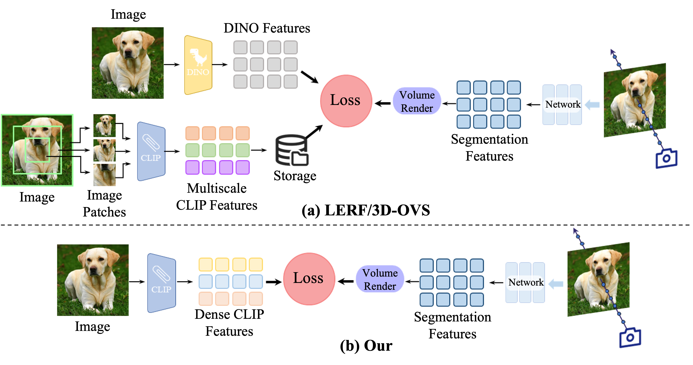

# [*T-pami 2025*] Laser: Efficient Language-Guided Segmentation in Neural Radiance Fields

This repository is offical implementation for the paper: [Laser: Efficient Language-Guided Segmentation in Neural Radiance Fields](https://arxiv.org/abs/2501.19084).


## TL;DR

Laser is a method for efficient 3D segmentation that uses CLIP feature distillation with language guidance. Instead of using multi-scale CLIP features, our method directly extracts dense CLIP features with an adapter module and reduces noise through self-cross-training. A low-rank transient query attention mechanism improves the segmentation edges, and by converting the segmentation task into classification with a label volume, the method maintains consistency in regions with similar colors. A simple text augmentation strategy reduces ambiguity between CLIP features and text. Experimental results show that our method is both faster and more effective than existing approaches.


<div align=center>  

</div>

Workflows of existing methods and Ours: (a) The core of the LERF/3D-OVS process initially adopts a cutting strategy that subdivides the training images into patches of different sizes. These patches are then fed into the CLIP encoder to extract multi-scale CLIP features, which are subsequently saved. At the same time, the original image is also input into DINO to extract DINO features. Afterwards, these multi-scale CLIP features and DINO features participate together in the segmentation branch optimization process of NeRF. Such a process demands significantly high computational and storage resources. (b) Compared to previous methods, our process only requires the input of training images into a modified CLIP encoder, after which it can predict dense CLIP features. Utilizing these features, the segmentation branch of NeRF can be optimized efficiently, while significantly reducing the consumption of computational and storage resources.

---

## Installation
> Tested on Ubuntu 24.04 + Pytorch 1.12.1

Install environment:
```
conda create -n laser python=3.9
conda activate Laser
pip install torch torchvision
pip install ftfy regex tqdm scikit-image opencv-python configargparse lpips imageio-ffmpeg kornia tensorboard
pip install git+https://github.com/openai/CLIP.git
```

## Datasets and Checkpoints

Please download the datasets and checkpoints from [this link](https://drive.google.com/file/d/1D5mbK8y00H2iK1zd8UO2RYTQ7N1QArWj/view?usp=sharing). The folder contains two subfolders: one for the datasets and one for the checkpoints. Place the datasets in `./data` and the checkpoints in the corresponding folder (or update the paths in the configuration files if you choose different locations).

The datasets are organized as follows:
```
/data
|  /scene0
|  |--/images
|  |  |--00.png
|  |  |--01.png
|  |  ...
|  |--/segmentations
|  |  |--classes.txt
|  |  |--/test_view0
|  |  |  |--class0.png
|  |  |  ...
|  |  |--/test_view1
|  |  |  |--class0.png
|  |  |  ...
|  |  ...
|  |--poses_bounds.npy
|  /scene1
|  ...
```
Here, `images` contains the RGB images, `segmentations` includes the segmentation annotations for the test views, `segmentations/classes.txt` stores the class descriptions, and `poses_bounds.npy` holds the camera poses generated by Colmap.

## Quick Start

To test the segmentation, run:
```
bash scripts/test_segmentation.sh [CKPT_PATH] [CONFIG_FILE] [GPU_ID]
```
The configuration files are located in the `configs` folder, with each file named as `configs/$scene_name.txt`. The results will be saved in the checkpoint folder. More details can be found in `scripts/test_segmentation.sh`.


## Training

### 1. Train original TensoRF

This step is for building the TensoRF for the scenes. Please change the `datadir` and `expname` in `configs/reconstruction.txt` to set the dataset path and the experiment name. By default, `datadir` is set to `data/$scene_name` and `expname` is set to `$scene_name`. Then, start the training by running:
```
bash scripts/reconstruction.sh [GPU_ID]
```
The trained TensoRF will be saved in `log/$scene_name`.

### 2. Train segmentation

The training script for segmentation is available in the `configs` folder as `$scene_name.txt`. Run the training by:
```
bash scripts/segmentation.sh [CONFIG_FILE] [GPU_ID]
```
The segmentation model will be saved in `log_seg/$scene_name`. The training takes about 11min on a single RTX 3090.


---
## Acknowledgments
This repo is heavily based on the [TensoRF](https://github.com/apchenstu/TensoRF), [3D-OVS](https://github.com/Kunhao-Liu/3D-OVS), [SCLIP](https://github.com/wangf3014/SCLIP). Thank them for sharing their amazing work!

## Citation
```
@ARTICLE{10857592,
  author={Miao, Xingyu and Duan, Haoran and Bai, Yang and Shah, Tejal and Song, Jun and Long, Yang and Ranjan, Rajiv and Shao, Ling},
  journal={IEEE Transactions on Pattern Analysis and Machine Intelligence}, 
  title={Laser: Efficient Language-Guided Segmentation in Neural Radiance Fields}, 
  year={2025},
  pages={1-13},
  keywords={Three-dimensional displays;Neural radiance field;Image segmentation;Semantics;Feature extraction;Training;Rendering (computer graphics);Visualization;Solid modeling;Accuracy;3D segmentation;CLIP;NeRF},
  doi={10.1109/TPAMI.2025.3535916}}
```